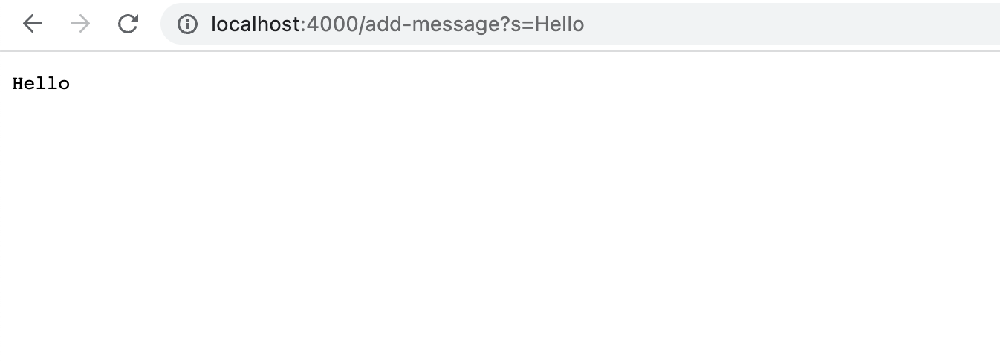
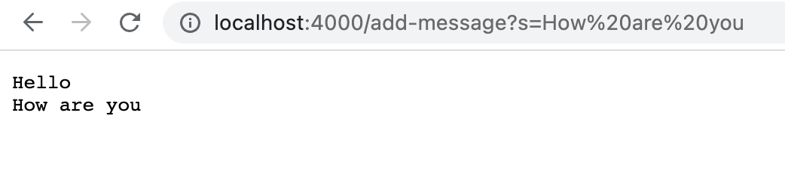
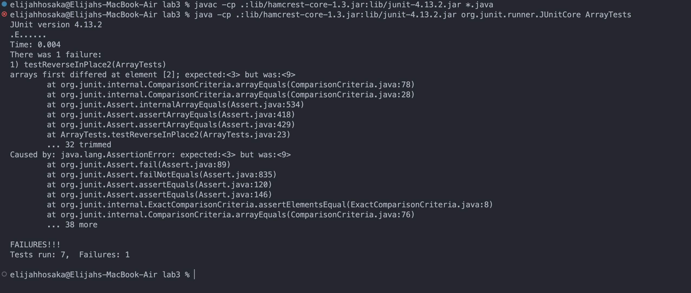

# UCSD CSE15L Lab Report 2

Week 2 and 3 Labs

## Part 1

**StringServer.java**

```java
class StringServer {
    public static void main(String[] args) throws IOException {
        if(args.length == 0){
            System.out.println("Missing port number! Try any number between 1024 to 49151");
            return;
        }

        int port = Integer.parseInt(args[0]);

        Server.start(port, new Handler());
    }
}
```

**Handler.java**

```java
class Handler implements URLHandler {
    ArrayList<String> items = new ArrayList<>();

    public String handleRequest(URI url) {
        if (url.getPath().equals("/")) {
            return items.toString();
        } else if (url.getPath().equals("/add-message")) {
            String[] parameters = url.getQuery().split("=");
            if (parameters[0].equals("s")) {
                items.add(parameters[1]);
                String delimiter = "\n";
                String printArray = String.join(delimiter, items);
                return printArray;
            }
        } else {
            return "404 Not Found!";
        }

        return null;
    }
}
```

**First Screenshot**


- This is calling the handRequest method
- The argument that gets passed to this method is a `new URI("http://localhost:4000/add-message?s=Hello)` called `url`
- The field `ArrayList<String> items` is empty before the request
- After this specific request, the field `ArrayList<String> items` gets `"Hello"` added as the first element


**Second Screenshot**


- This is calling the handRequest method again
- The argument that gets passed to this method is a `new URI("http://localhost:4000/add-message?s=How%20are%20you)` called `url`
- The field `ArrayList<String> items` contains `"Hello"` at index 0 before the request
- After this specific request, the field `ArrayList<String> items` gets `"How are you"` added as another element


## Part 2

### Bug in the Array Method reverseInPlace()

**A Non Failure-inducing Input:**

```java
@Test
  public void testReverseInPlace() {
    int[] input1 = { 3 };
    ArrayExamples.reverseInPlace(input1);
    assertArrayEquals(new int[]{ 3 }, input1);
}
```

**A Failure-inducing Input:**

```java
@Test
  public void testReverseInPlace2() {
    int[] input1 = {3, 6, 9};
    ArrayExamples.reverseInPlace(input1);
    assertArrayEquals(new int[]{9,6,3}, input1);
}
```

**The Symptom**



**The Bug**

Before

```java
static void reverseInPlace(int[] arr) {
    for(int i = 0; i < arr.length; i += 1) {
        arr[i] = arr[arr.length - i - 1];
    }
}
```

After

```java
static void reverseInPlace(int[] arr) {
    for (int i = 0; i < arr.length / 2; i++) {
      int temp = arr[i];
      arr[i] = arr[arr.length - i - 1];
      arr[arr.length - i - 1] = temp;
    }
}
```

**The Fix**

One of the fixes for the bug was to change the for loop condition to `i < arr.length / 2` so the method only swapped the values in the front and the back of the array once. 

The other fix was to add `int temp = arr[i];` and `arr[arr.length - i - 1] = temp;` within the body of the for loop to make sure the elements in the back of the array got assigned their new value as well.


## Part 3

In lab 2, I learned how to clone a repository using Github Desktop to a local directory. I found this very useful because before, I would download a repository as a zip file and manually commit changes and push it to the repository if I wanted to update it. Now I can just do all that through Github Desktop or even through my IDE, VS code. This procedure helps to streamline the version control process, making it easier to version control my projects in the future.
