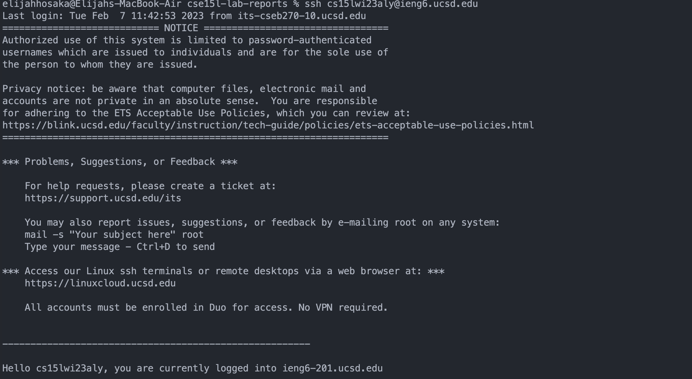
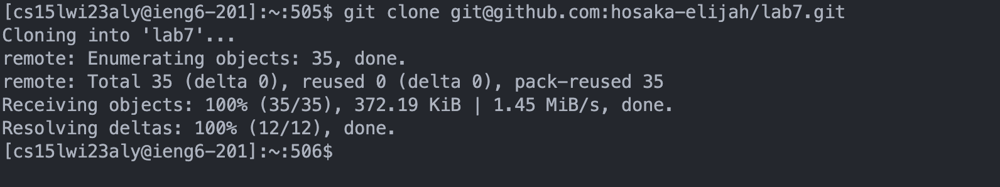
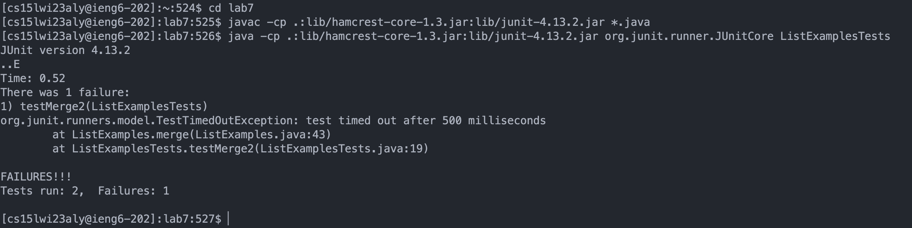
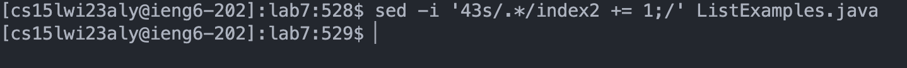
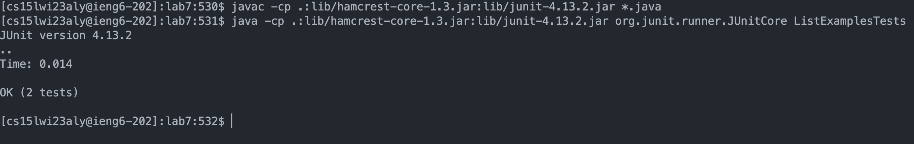
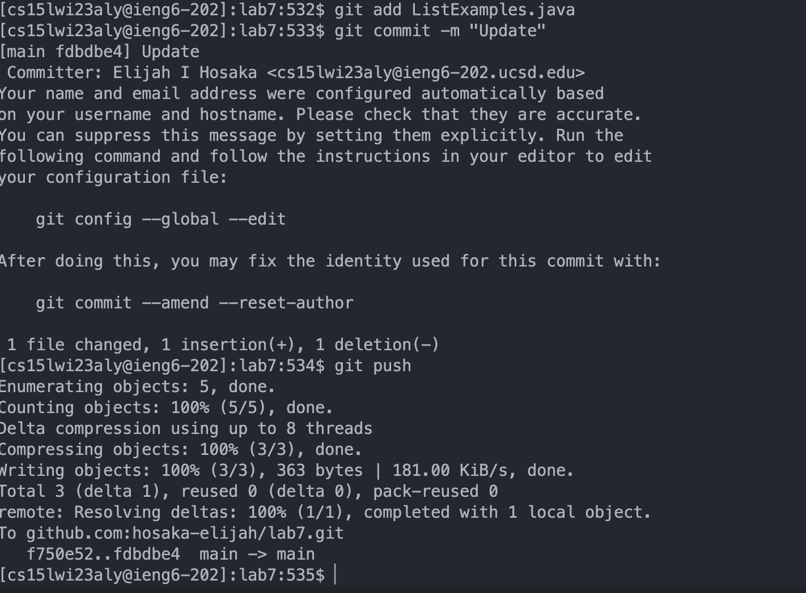

# UCSD CSE15L Lab Report 4

Week 6 and 7 Labs

## Step 1. (Setup) Delete any existing forks of the repository you have on your account

## Step 2. (Setup) Fork the repository

## Step 3. (Setup) Start the timer

## Step 4. Log into ieng6

**Keys pressed** 

`ssh cs15lwi23aly@ieng6.ucsd.edu<enter>`

**Description**

The `ssh cs15lwi23aly@ieng6.ucsd.edu` command logs me into the remote server account cs15lwi23aly on the ieng6 server.

## Step 5. Clone your fork of the repository from your Github account

**Keys pressed**

`git clone git@github.com:hosaka-elijah/lab7.git<enter>`

**Description**

The `git clone git@github.com:hosaka-elijah/lab7.git` command clones the forked repository of lab7 from my Github account to my current directory in the remote server.

## Step 6. Run the tests, demonstrating that they fail

**Keys pressed**

`cd lab7<enter>`

`javac -cp .:lib/hamcrest-core-1.3.jar:lib/junit-4.13.2.jar *.java<enter>`

`java -cp .:lib/hamcrest-core-1.3.jar:lib/junit-4.13.2.jar org.junit.runner.JUnitCore ListExamplesTests<enter>`

**Description**

The `cd lab7` command changes directories to lab7 so I can compile and run the tests inside the directory. 

The `javac -cp .:lib/hamcrest-core-1.3.jar:lib/junit-4.13.2.jar *.java` compiles all the java files using the wildcard symbol `*` in `*.java`.

The `java -cp .:lib/hamcrest-core-1.3.jar:lib/junit-4.13.2.jar org.junit.runner.JUnitCore ListExamplesTests` runs the test file `ListExamplesTests.java` to show that the tests fail.

## Step 7. Edit the code file to fix the failing test

**Keys pressed**

`sed -i '43s/.*/index2 += 1;/' ListExamples.java<enter>`

**Description**

The command `sed -i '43s/.*/index2 += 1;/' ListExamples.java` replaces line 43 (which had the bug) in the file `ListExamples.java` to `index2 += 1;` in order to fix the bug.

## Step 8. Run the tests, demonstrating that they now succeed

**Keys pressed**

`javac -cp .:lib/hamcrest-core-1.3.jar:lib/junit-4.13.2.jar *.java<enter>`

`java -cp .:lib/hamcrest-core-1.3.jar:lib/junit-4.13.2.jar org.junit.runner.JUnitCore ListExamplesTests<enter>`

**Description**

The `javac -cp .:lib/hamcrest-core-1.3.jar:lib/junit-4.13.2.jar *.java` compiles all the java files using the wildcard symbol `*` in `*.java`.

The `java -cp .:lib/hamcrest-core-1.3.jar:lib/junit-4.13.2.jar org.junit.runner.JUnitCore ListExamplesTests` runs the test file `ListExamplesTests.java` to show that the tests now succeed.

## Step 9. Commit and push the resulting change to your Github account

**Keys pressed**

`git add ListExamples.java`

`git commit -m "Update"`

`git push`

**Description**

The command `git add ListExamples.java` stages the changes made to ListExamples.java so it is ready to commit.

The command `git commit -m "Update"` commits the staged changes to the local repository with the commit message being after the `-m` option which is `"Update` in this case.

The command `git push` pushes the updated local repository to the repository on Github to update changes there.