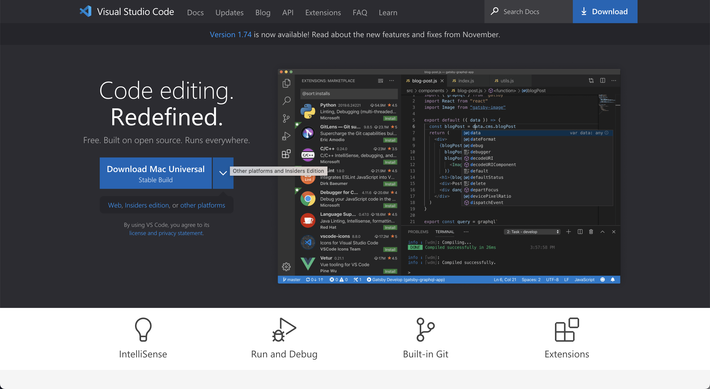
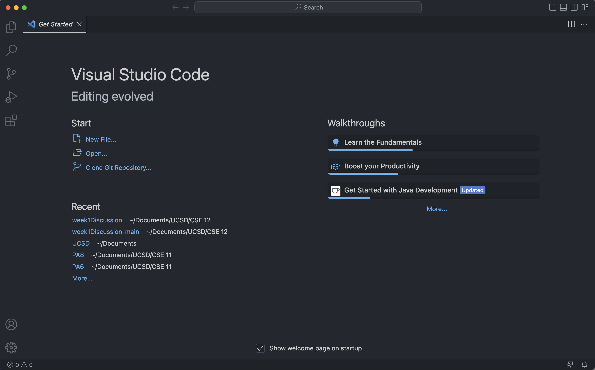
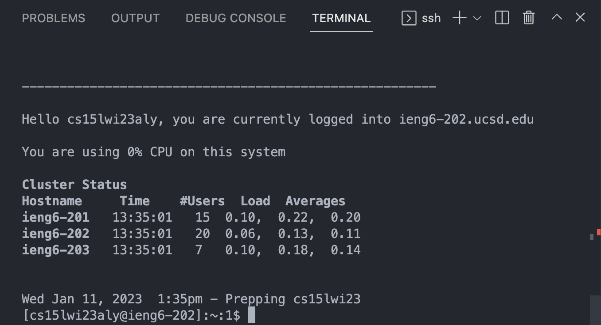
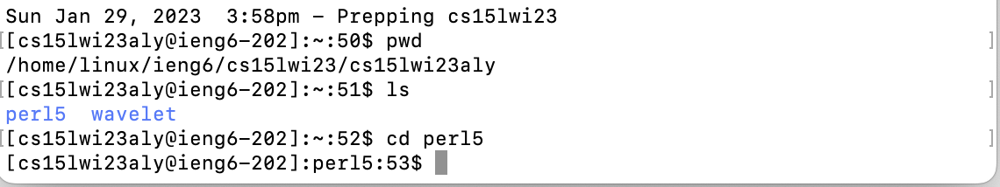

# UCSD CSE15L Lab Report 1

Installing VScode, Remotely Connecting, and Trying Some Commands.

## Installing VScode

1. Go to the VScode website [here](https://code.visualstudio.com/) 

    It should look like this: 

    

2. Click the blue button that says "Download Mac Universal" and follow the intruction to install

3. After installing, open VScode

    It should look like this:
    
    
    

## Remotely Connecting

1. Open a terminal in VScode (press Ctrl + `)

2. Type in the command: *ssh cs15lwi23___@ieng6.ucsd.edu*

    > (replace the ___ with your course-specific account)
    
3. If this is your first time connecting to the server, you'll probably be asked if you want to continue connecting. Type yes

4. Type in your password and you should be logged in which looks like this:

    

## Trying Some Commands

1. After successfully logging in your remote server, try some commands such as:

    - *pwd* 
        > This command prints out the current working directory.
    - *ls*
        > This command lists all the files except hidden ones in your current directory.
    - *ls -a*
        > This command lists all the files including hidden ones in your current directory.
    - *cd (directory path)*
        > This command changes directory to the (directory path).
    - *cd ~*
        > This command changes directory to the home directory.

    It should look something like this:
    
    
    
    In this picture, we are printing (*pwd*) the current working directory and then listing (*ls*) the files in there. Then, we change directories (*cd*) into perl5, and we know this command was successfull because no message printed and the terminal was ready for the next command.

2. When you are done trying commands, log out of the remote server by:

    - pressing Ctrl + D

        or
    
    - typing *exit*
