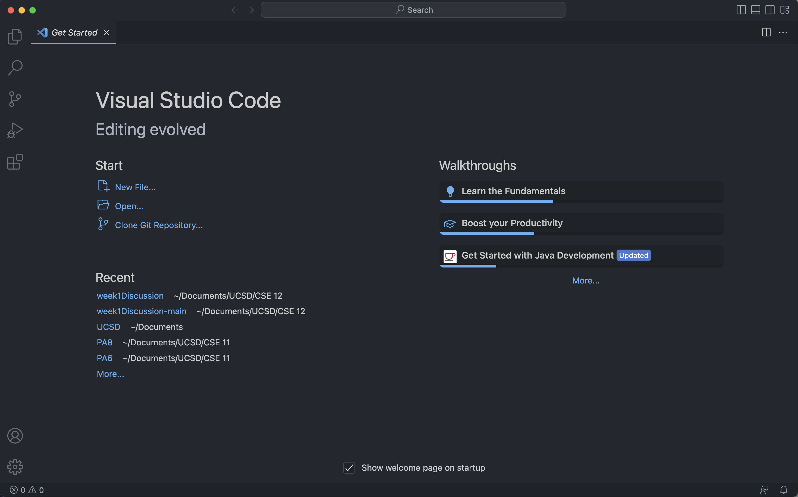

# UCSD CSE15L Week 1 Lab Report

Installing

## Installing VScode

1. Go to the VScode website [here](https://code.visualstudio.com/) 

    It should look like this: 

    

2. Click the blue button that says "Download Mac Universal" and follow the intruction to install

3. After installing, open VScode

    It should look like this:
    
    
    

## Remotely Connecting

1. First, open a terminal in VScode (press control + `)

2. Then type in the command: ssh cs15lwi23___@ieng6.ucsd.edu

    (replace the ___ with your course-specific account)
    
3. 

## Trying Some Commands
